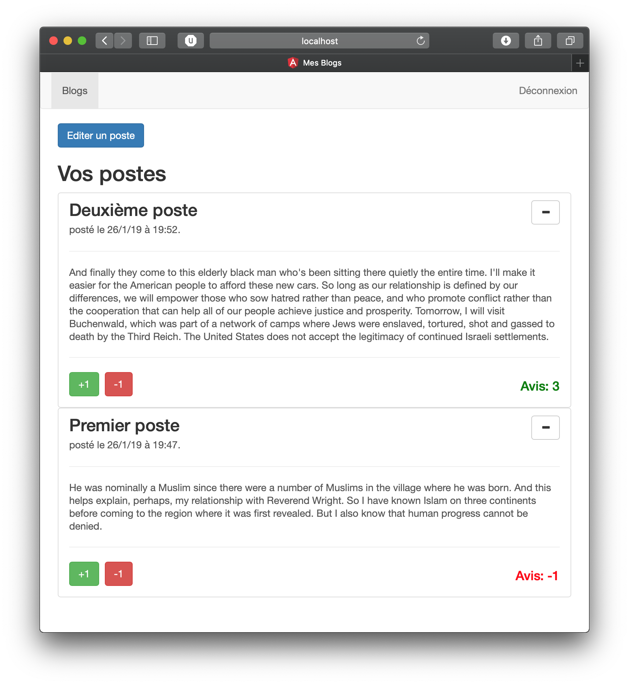

# OpenClassRooms-Angular-Blog

Projet final du cours [Angular](https://openclassrooms.com/fr/courses/4668271-developpez-des-applications-web-avec-angular) d'OpenClassRooms.

---



## Services utilisés

- [Cloud Firestore](https://cloud.google.com/firestore/)
- [Firebase Authentication](https://firebase.google.com/products/auth/)

## Installation

Installez les packages requis depuis la racine du projet:

```
npm install --save firebase@5.8.1 bootstrap@3.3.7
```

Copiez le contenu de [app.component.ts.dist](src/app/app.component.ts.dist) vers [app.component.ts](src/app/app.component.ts) en prenant soin de remplacer les clés d'API par celle de votre projet.

Après avoir lancé le serveur avec `ng serve --open`, ouvrez 2 fenêtres vers [localhost:4200](http://localhost:4200). Vous pouvez maintenant tester l'application en observant les changements s'effectuer sur les 2 pages.
